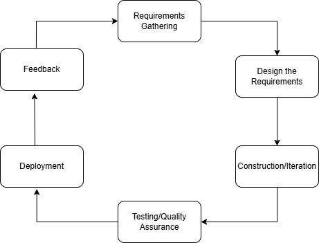

### processing-system
system for SMEs for paperless and make the indicated features below automated, get record online and easy.

## FEATURES
- *Advance Payment Form*
- *Overtime Authorization Form*
- *Request for Payment Form*
- *Work Permit Form*
- *Leave Application Form*
- *Reimbursement Form*
- *Liquidation Form*
- *Vehicle Request Form*

## TECH-STACK
- *PHP*
- *MySQL*

## TOOLS TO USE
- *Composer*
- *PHPMailer*
- *vlucas/phpdotenv
- Bootstrap 5

## DB DESIGN
- **users**           -- employees + roles (admin, approver, staff)
- **forms**        -- generic: id, type, status, submitted_by, created_at
- **form_data**     -- JSON or EAV for form-specific fields
- **approvals**       -- approval chain: form_id, approver_id, status, remarks
- **audit_logs**      -- who did what and when

## PROJECT-STRUCTURE
```
    processing-system/
    ├── app/
    │   ├── Controllers/        # Business logic per form
    │   ├── Models/             # DB interactions
    │   ├── Middleware/         # Auth, role checks
    │   └── Helpers/            # Reusable utilities
    ├── config/
    │   ├── database.php
    │   └── app.php
    ├── public/                 # Entry point, assets
    │   └── index.php
    ├── views/
    │   ├── layouts/            # Base templates
    │   └── forms/              # One view per form
    ├── routes/
    │   └── web.php
    ├── migrations/             # DB schema versioning
    └── .env                    # Environment config (never commit)
```

### SDLC - AGILE MODEL
This project uses Agile Model to adapt to sudden and quick client project request.
Steps in the Agile Model

### The Agile Model
is a type of approach iterative and incremental process models. 
### The phases involve in Agile (SDLC) Model are: 
- **Requirement Gathering**
- **Design the Requirements**
- **Construction / Iteration**
- **Testing / Quality Assurance**
- **Deployment**
- **Feedback**

